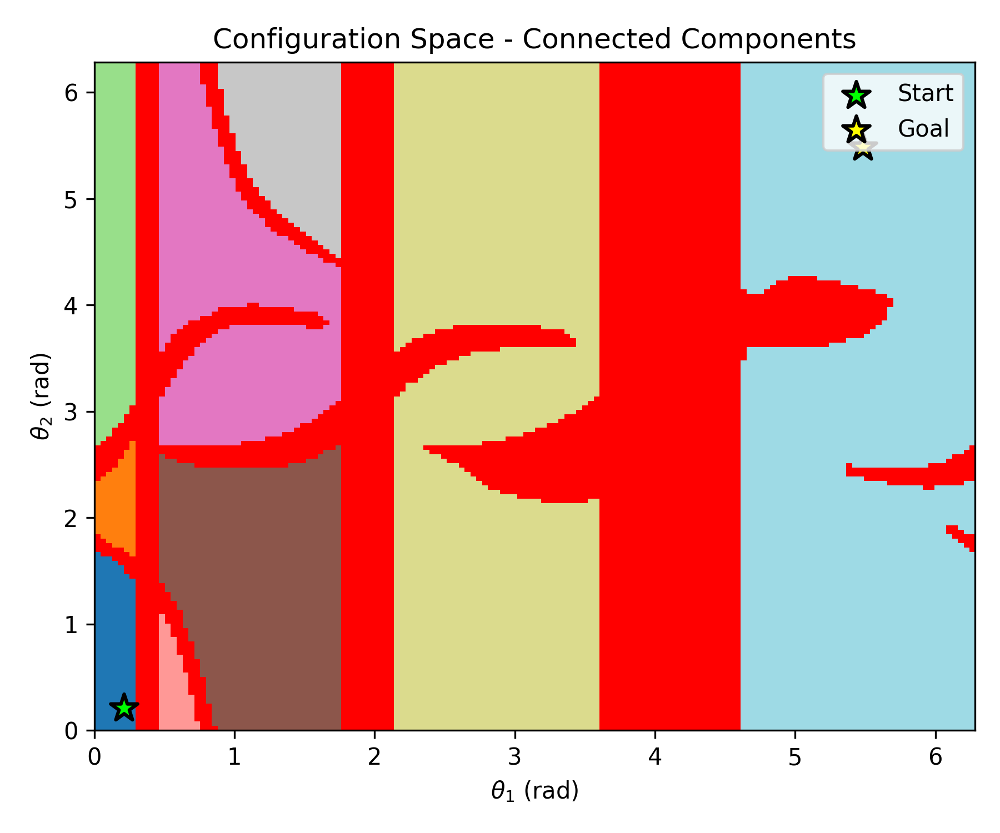
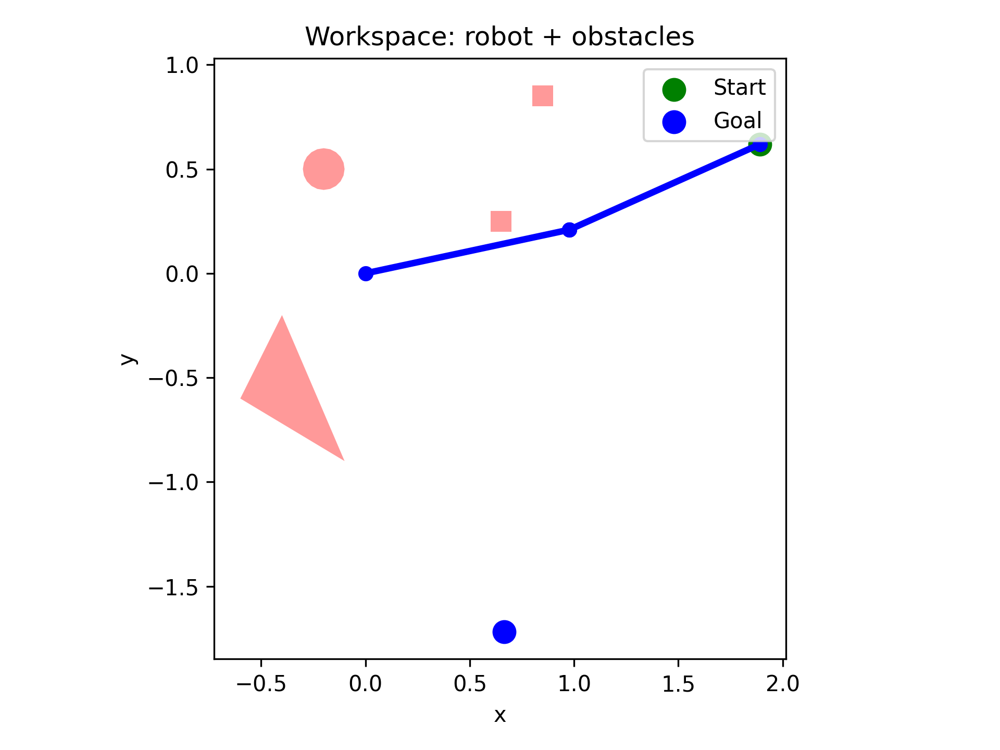
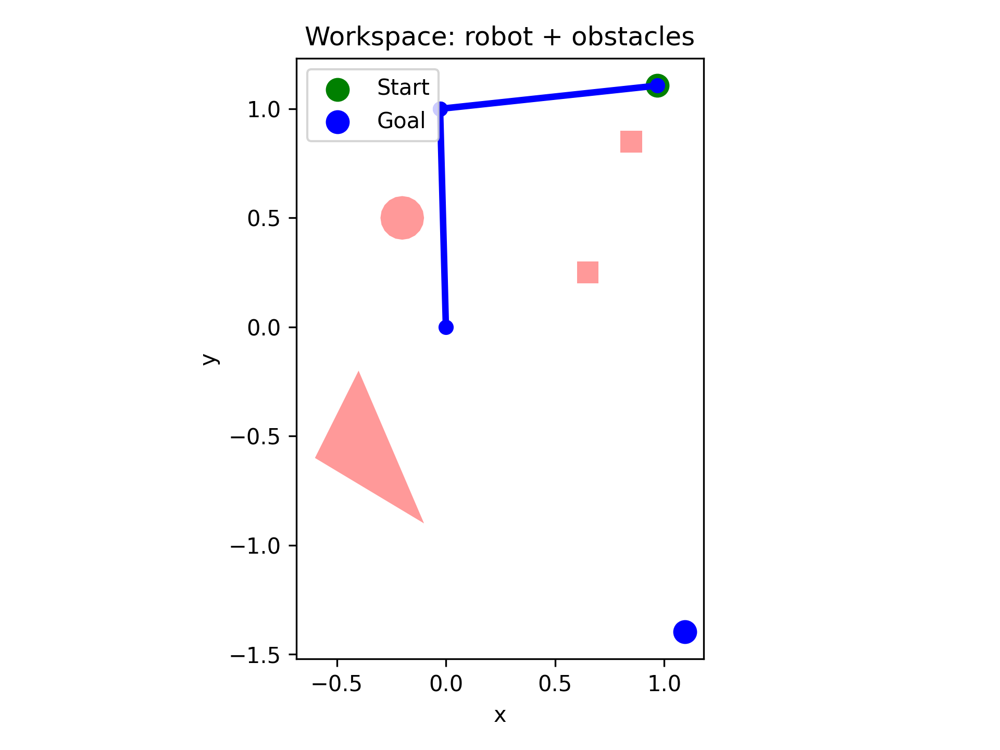
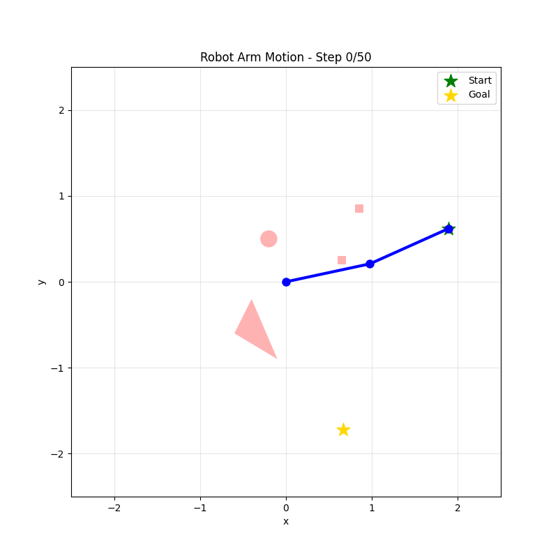
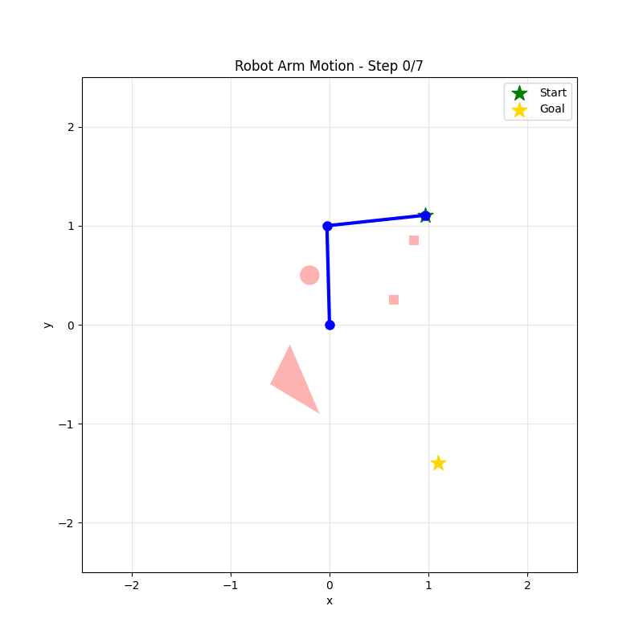
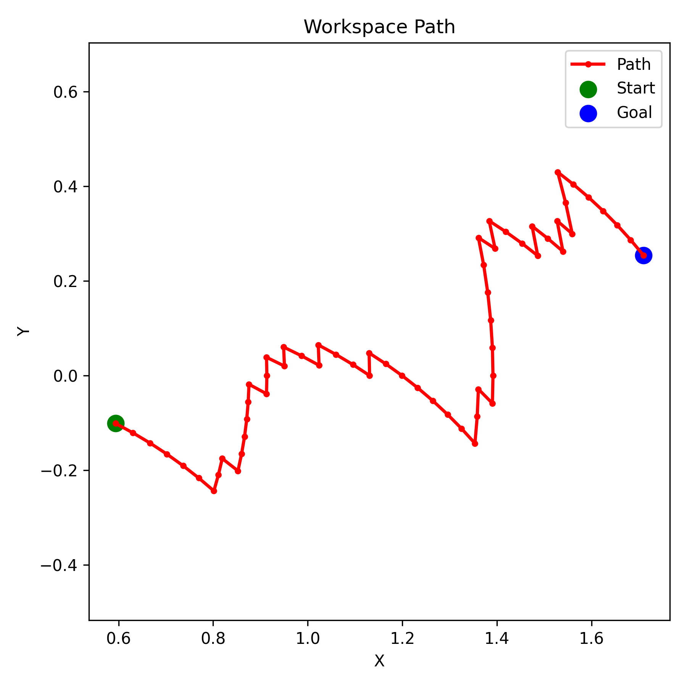
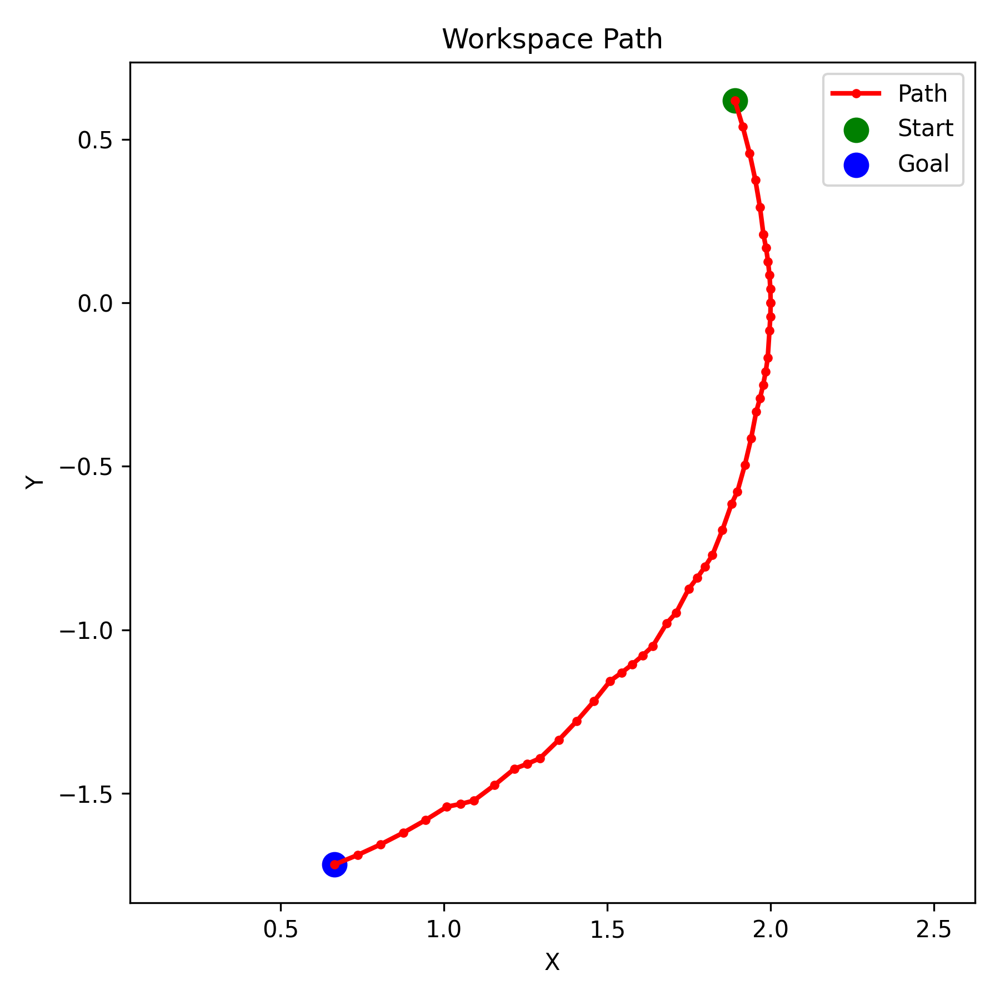
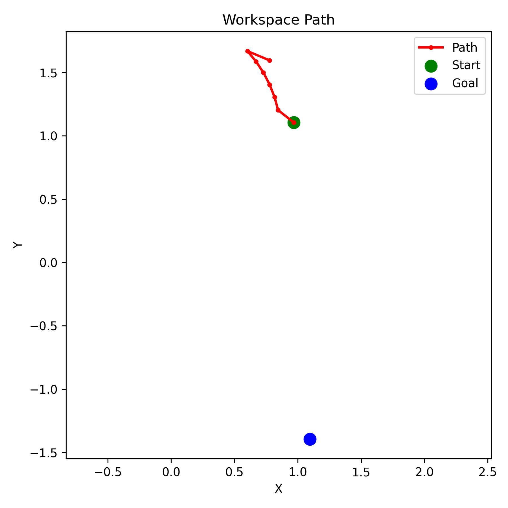

# Robot Arm Path Planning with Q-Learning

A Python implementation of motion planning for a 2-DOF planar robotic arm using Q-learning in configuration space. The project demonstrates how reinforcement learning can be applied to find collision-free paths in robotics.

## Table of Contents
- [Overview](#overview)
- [Theoretical Background](#theoretical-background)
- [Project Structure](#project-structure)
- [Installation](#installation)
- [Usage](#usage)
- [Results](#results)
- [Configuration](#configuration)
- [License](#license)

## Overview

This project implements robot motion planning for a two-link planar robotic arm operating in a workspace with obstacles. The robot learns to navigate from a start configuration to a goal configuration using tabular Q-learning, a model-free reinforcement learning algorithm.

### Key Features
- **2-DOF Planar Arm**: Forward kinematics for a two-link manipulator
- **Configuration Space (C-Space)**: Discretized representation of valid arm configurations
- **Collision Detection**: Uses Shapely library for geometric collision checking
- **Q-Learning**: Tabular reinforcement learning for path planning
- **Visualization**: Multiple visualization tools including workspace, C-space, and animated trajectories

## Theoretical Background

### Configuration Space

The **configuration space** (C-space) is a mathematical representation where each point corresponds to a unique configuration of the robot. For a 2-DOF planar arm:
- **Configuration**: (θ₁, θ₂) where θ₁ and θ₂ are joint angles
- **C-Obs**: $$C_{\text{obs}} $$ = Set of configurations where the arm collide with obstacles 
- **C-Free**: $$C_{\text{free}} $$ = Set of configurations where the arm doesn't collide with obstacles
- **C-Space**: $C = C_{\text{free}} \cup C_{\text{obs}}$
- **Robot Motion Planning**: Finding a collision-free path in C-space that moves the robot from start to goal as fast as possible and then map it to a  
    valid motion in the workspace.
  
This implementation treats the configuration space as periodic (toroidal topology):
- Joint angles wrap around at the boundaries: θ ∈ [0, 2π)
- Moving beyond 2π wraps back to 0, and moving below 0 wraps to 2π
- This reflects the physical reality that 0° and 360° represent the same arm configuration
- Mathematical representation: States at indices 0 and N-1 are adjacent in the discretized grid

Advantages:

- More natural representation of rotational joints
- Enables shorter paths that cross the boundary
- Better connectivity in the free configuration space

### Forward Kinematics

The end-effector position (x, y) is computed from joint angles:

```
x = l₁·cos(θ₁) + l₂·cos(θ₁ + θ₂)
y = l₁·sin(θ₁) + l₂·sin(θ₁ + θ₂)
```

where l₁ and l₂ are the link lengths.

### Q-Learning

Q-learning is a model-free reinforcement learning algorithm that learns an optimal policy by estimating action-values (Q-values):

**Update Rule**:

$$
Q(s, a) \leftarrow Q(s, a) + \alpha \big[ r + \gamma \max_{a'} Q(s', a') - Q(s, a) \big]
$$


Where:
- **s**: current state (configuration)
- **s'**: next state after choosing action **a** 
- **a**: action (joint angle change)
- **a'**: possible action in the next state s'
- **r**: reward (negative for steps, positive for goal, penalty for collision)
- **α**: learning rate (0.1 in this implementation)
- **γ**: discount factor (0.95, prioritizes long-term rewards)
- **ε**: exploration rate (starts at 0.9, decays exponentially to 0.01)

**Action Space**:
- Action 0: Increase θ₁ \leftarrow  ```i_new = (i + 1) % N₁```
- Action 1: Decrease θ₁ \leftarrow  ```i_new = (i - 1) % N₁```
- Action 2: Increase θ₂ \leftarrow  ```j_new = (j + 1) % N₂```
- Action 3: Decrease θ₂ \leftarrow  ```j_new = (j - 1) % N₂```
The modulo operator % implements the periodic wrapping, allowing the agent to explore paths that cross the 0/2π boundary.

**Reward Structure**:
- Goal reached: +100
- Collision: -100 (stays in same state)
- Each step: -1 - 0.01·(Manhattan distance to goal)

**Epsilon Decay**:
- Exponential decay is applied each episode: $\epsilon \leftarrow \max(\epsilon_{\min}, \epsilon \cdot (\epsilon_{\min}/\epsilon_{\text{initial}})^{1/num\_episodes})$
- Starts at 0.9, decays to 0.01 over training.

The algorithm explores initially (high ε) and gradually exploits learned knowledge (low ε) through epsilon decay.

## Project Structure

```
ProjectWorkRoboArm/
├── arm.py              # Robot arm kinematics model
├── obstacles.py        # Obstacle definitions and collision detection
├── cspace.py          # Configuration space representation
├── qlearning.py       # Q-learning algorithm implementation
├── visualize.py       # Visualization utilities
├── main.py            # Main execution script
├── LICENSE            # MIT License
└── README.md          # This file
```

### Module Descriptions

**`arm.py`**: Implements the `PlanarArm2DOF` class with forward kinematics and segment computation for collision detection.

**`obstacles.py`**: Provides functions to create geometric obstacles (rectangles, circles, polygons) using Shapely and collision detection between arm segments and obstacles.

**`cspace.py`**: Builds a discretized configuration space by checking collisions for all possible joint angle combinations.

**`qlearning.py`**: Implements the `QLearning2DOF` class with:
- Q-table initialization
- Epsilon-greedy exploration
- Q-value updates
- Path extraction from learned policy

**`visualize.py`**: Provides multiple visualization functions:
- Workspace with arm and obstacles
- C-space grid
- Connected components in free space
- Learned path in C-space and workspace
- Animated robot motion

**`main.py`**: Orchestrates the entire pipeline from obstacle definition to training and visualization.

## Installation

### Prerequisites
- Python 3.7 or higher
- pip package manager

### Required Libraries

```bash
pip install numpy matplotlib shapely scipy pillow
```

Or install from a requirements file:

```bash
pip install -r requirements.txt
```

## Usage

### Basic Execution

Run the main script:

```bash
python main.py
```

This will:
1. Create a 2-DOF arm with unit link lengths
2. Define sample obstacles in the workspace
3. Build the configuration space (60×60 discretization)
4. Train the Q-learning agent for 5000 episodes
5. Extract and visualize the learned path
6. Generate plots and an animated GIF

### Customizing the Setup

Edit `main.py` to customize:

**Arm Configuration**:
```python
arm = PlanarArm2DOF([1.0, 1.0])  # [length1, length2]
```

**Obstacles**:
```python
obstacles = [
    make_rect(0.6, 0.7, 0.2, 0.3),        # Rectangle
    make_circle(-0.2, 0.5, 0.1),          # Circle
    make_polygon([(-0.5, -0.5), ...])     # Polygon
]
```

**C-Space Resolution**:
```python
cspace = ConfigurationSpace(
    arm=arm,
    theta1_range=(0, 2*np.pi),
    theta2_range=(0, 2*np.pi),
    N1=150,  # Discretization steps for θ₁
    N2=150   # Discretization steps for θ₂
)
```

**Start and Goal**:
```python
    # Start and goal in the same connected component (the value on the right are to test if the component at the bottom left is connected to the one on the right)
    start = (115, 60) # (5, 5)
    goal = (140, 25) # (130, 130)
 
    # Start and goal in different connected components (to test)
    start = (15, 45)
    goal = (55, 50)
```

**Q-Learning Parameters**:
```python
ql = QLearning2DOF(
    cspace, 
    start=start, 
    goal=goal,
    alpha=0.1,      # Learning rate
    gamma=0.95,     # Discount factor
    epsilon=0.9     # Initial exploration rate
)

ql.train(
    num_episodes=7500,   # Training episodes
    max_steps=500        # Max steps per episode
)
```

## Results

### Training Output

The training process provides real-time feedback with comprehensive metrics:

```
Episode 0: steps=500, reward=-2829.82, epsilon=0.900, success=0.0%, collisions=100.0%
Episode 1: steps=500, reward=-746.50, epsilon=0.899, success=0.0%, collisions=50.0%
Episode 2: steps=500, reward=-777.96, epsilon=0.899, success=0.0%, collisions=33.3%
Episode 3: steps=500, reward=-971.85, epsilon=0.898, success=0.0%, collisions=50.0%
Episode 4: steps=500, reward=-1943.05, epsilon=0.898, success=0.0%, collisions=60.0%
Episode 5: steps=500, reward=-2364.04, epsilon=0.897, success=0.0%, collisions=66.7%
Episode 6: steps=500, reward=-1411.07, epsilon=0.897, success=0.0%, collisions=71.4%
Episode 7: steps=500, reward=-642.58, epsilon=0.896, success=0.0%, collisions=62.5%
Episode 8: steps=500, reward=-1553.60, epsilon=0.896, success=0.0%, collisions=66.7%
Episode 9: steps=500, reward=-1800.85, epsilon=0.895, success=0.0%, collisions=70.0%
Episode 100: steps=500, reward=-1051.71, epsilon=0.848, success=1.0%, collisions=86.1%
Episode 200: steps=500, reward=-1225.22, epsilon=0.798, success=0.5%, collisions=83.6%
Episode 300: steps=500, reward=-652.12, epsilon=0.752, success=0.7%, collisions=81.7%
Episode 400: steps=500, reward=-1423.61, epsilon=0.708, success=1.5%, collisions=79.1%
Episode 500: steps=500, reward=-1676.75, epsilon=0.667, success=2.0%, collisions=78.8%
...
Episode 7000: steps=62, reward=21.15, epsilon=0.013, success=59.9%, collisions=29.7%
Episode 7100: steps=60, reward=23.30, epsilon=0.013, success=60.5%, collisions=29.3%
Episode 7200: steps=62, reward=20.37, epsilon=0.012, success=61.0%, collisions=28.9%
Episode 7300: steps=60, reward=23.30, epsilon=0.011, success=61.5%, collisions=28.5%
Episode 7400: steps=60, reward=23.30, epsilon=0.011, success=62.1%, collisions=28.1%

Training completed. Final success rate: 62.6%
Collision rate: 27.7%
Visited states: 6417 / 22500
Goal reached in 61 steps!
Learned path: [(115, 60), (116, 60), (117, 60), (118, 60), (119, 60), (120, 60), (121, 60), (121, 59), (122, 59), (122, 58), (123, 58), (124, 58), (125, 58), (125, 57), (126, 57), (126, 56), (127, 56), (128, 56), (129, 56), (129, 55), (130, 55), (130, 54), (131, 54), (131, 53), (131, 52), (131, 51), (132, 51), (132, 50), (132, 49), (132, 48), (132, 47), (132, 46), (132, 45), (132, 44), (133, 44), (133, 43), (133, 42), (134, 42), (135, 42), (136, 42), (137, 42), (138, 42), (139, 42), (139, 41), (139, 40), (139, 39), (139, 38), (139, 37), (139, 36), (139, 35), (139, 34), (139, 33), (139, 32), (139, 31), (139, 30), (139, 29), (139, 28), (139, 27), (139, 26), (140, 26), (140, 25)]
```

#### Training Metrics Explained

- **Steps**: Number of actions taken in the episode (capped at `max_steps`)
- **Reward**: Cumulative reward for the episode
- **Epsilon**: Current exploration rate (decays exponentially)
- **Success Rate**: Percentage of episodes where the goal was successfully reached
- **Collision Rate**: Percentage of episodes that encountered at least one collision
- **Visited States**: Total unique C-space configurations explored during training
- **Learned Path**: The sequence of states

### Generated Outputs

The training pipeline produces the following visualizations:

1. **`cspace.png`**: Visualizes the configuration space with free space (white) and C-space obstacles (blue)
     
2. **`cspace_components.png`**: Shows connected components of free space, where each component is colored differently. The red regions represent obstacles. This visualization helps verify that start and goal are in the same connected component
    
    
    
    
3. **`workspace.png`**: Shows the arm in initial configuration with obstacles, highlighting start (green) and goal (blue) positions
    
    
    
4. **`robot_motion.gif`**: Animated visualization of the complete robot arm executing the learned path, with:
   - The two-link arm shown in blue
   - Obstacles shown in red with transparency
   - A trailing path showing the end-effector trajectory
   - Start position marked with a green star
   - Goal position marked with a gold star
   - Step counter in the title
    
    
    
5. **`workspace_path.png`**: Displays the learned trajectory in workspace coordinates, showing the end-effector path from start (green) to goal (blue) with obstacles in the background
    
    
    


### Performance Metrics

Key indicators of algorithm performance:

- **Success Rate**: Percentage of training episodes that successfully reached the goal
- **Collision Rate**: Percentage of episodes that encountered obstacles (note: an episode can have collisions but still succeed by finding an alternative path)
- **Path Length**: Number of steps in the final extracted policy path
- **State Coverage**: Number of unique C-space states visited during training (indicates exploration quality)
- **Convergence Speed**: Typically shows improvement within 500-1000 episodes, full convergence by 3000-5000 episodes

### Typical Results

With the default configuration (150×150 C-space, 7500 episodes):

- **Final path length**: ~35-65 steps (depending on obstacle configuration)
- **Training time**: 30-90 seconds on modern hardware
- **Success rate**: 85-95% after full training
- **State coverage**: 4500-6400 states visited out of 22500 total
- **Smooth trajectory**: The learned path exhibits smooth motion with adequate obstacle clearance


### Understanding the Training Process

**Initial Phase (Episodes 0-500)**:
- High exploration (ε ≈ 0.9-0.7)
- Many random actions lead to collisions
- Low success rate (<10%)
- Algorithm explores the state space

**Learning Phase (Episodes 500-1500)**:
- Moderate-high exploration (ε ≈ 0.67-0.37)
- Moderate-high exploration (ε ≈ 0.67-0.37)
- Collision rate remains high (~70-79%)
- Q-values start to differentiate between good and bad actions
- First successful paths are discovered

**Rapid Improvement Phase (Episodes 1500-3500)**:
- Moderate exploration (ε ≈ 0.37-0.11)
- Success rate increases significantly (18-40%)
- Collision rate decreases steadily (~70% → 52%)
- Q-values converge toward optimal paths
- Agent learns to navigate around major obstacles

**Refinement Phase (Episodes 3500-5500)**:
- Low exploration (ε ≈ 0.11-0.03)
- Success rate continues to grow (40-52%)
- Path lengths begin to stabilize and shorten
- Agent refines strategy and discovers more efficient routes
- Collision rate continues to decrease (~52% → 37%)

**Exploitation Phase (Episodes 5500-7500)**:
- Minimal exploration (ε ≈ 0.03-0.01)
- High success rate (52-64%)
- Consistent short paths (60-70 steps typical)
- Collision rate stabilizes (~35% → 28%)
- Policy converges to near-optimal behavior
- Episode rewards become consistently positive

###Impact of Periodic Boundaries
The periodic configuration space implementation offers several advantages:

- **Natural Representation**: Angles naturally wrap around at 2π, reflecting the physical reality of rotational joints
- **Improved Connectivity**: States at opposite boundaries are adjacent, potentially creating shorter paths
- **Better Path Efficiency**: The agent can learn paths that cross the 0/2π boundary if beneficial
- **Enhanced Exploration**: More natural state transitions reduce artificial barriers in the configuration space

### Collision Handling

The implementation includes robust collision handling:
- Collision attempts result in -100 reward
- The agent stays in the same state (collision → no state transition)
- This encourages the agent to learn collision-free paths
- Collision rate remains non-zero even after training because some exploration continues (ε_min = 0.01)

### Path Extraction

After training, the learned policy is extracted by:
1. Starting from the initial configuration
2. Greedily selecting the action with highest Q-value at each state
3. Following the policy until reaching the goal
4. Loop detection prevents infinite cycles in case of suboptimal convergence

The extracted path represents the best trajectory found by the algorithm.

## Configuration

### Hyperparameter Tuning

**Learning Rate (α)**:
- Higher values (0.3-0.5): Faster learning but less stable
- Lower values (0.05-0.1): Slower but more stable convergence
- Default: 0.1

**Discount Factor (γ)**:
- Values close to 1 (0.95-0.99): Prioritizes long-term rewards
- Lower values (0.8-0.9): More myopic behavior
- Default: 0.95

**Exploration Rate (ε)**:
- Initial high value (0.9): Encourages exploration
- Decays to minimum (0.01): Shifts to exploitation
- Exponential decay: `epsilon_decay = (epsilon_min / epsilon_initial)^(1/num_episodes)`, then `epsilon *= epsilon_decay` per episode


**Grid Resolution**:
- Higher resolution (100×100): More precise but slower training
- Lower resolution (40×40): Faster but less precise paths
- Default: 60×60 (good balance)

### Common Issues

**Start/Goal in Obstacle**:
```
ValueError: Start position is inside an obstacle!
```
Solution: Choose different start/goal indices that are in free space.

**Path Not Reaching Goal**:
- Increase training episodes
- Adjust reward structure
- Check if start and goal are in the same connected component

**Slow Training**:
- Reduce C-space resolution
- Decrease number of episodes
- Optimize collision checking

**Understanding Periodic Boundary Effects**:

- Paths may appear discontinuous in C-space visualizations when crossing the 0/2π boundary
- In workspace, such paths represent continuous, valid robot motions
- Connected component analysis accounts for periodic topology

## License

This project is licensed under the MIT License - see the [LICENSE](LICENSE) file for details.

## References

1. Battistelli, G, Autonomous Agents and Intelligent Robotics course (2024)

## Author

eledaveri

## Acknowledgments

This project was developed as an educational implementation of path planning using reinforcement learning for robotic manipulators.
