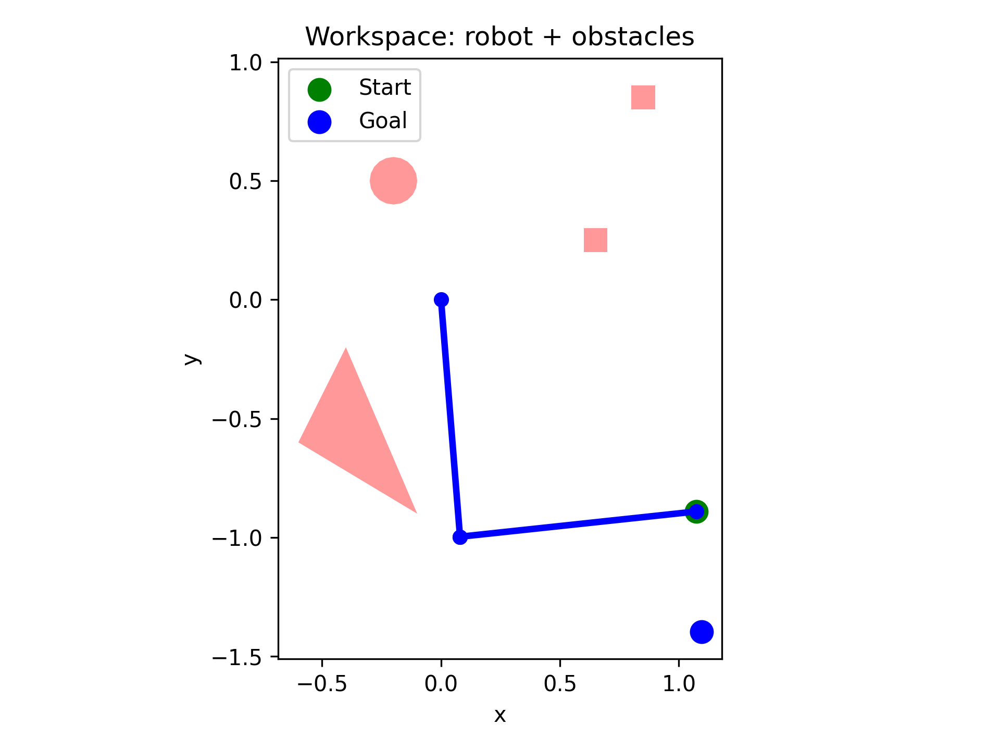
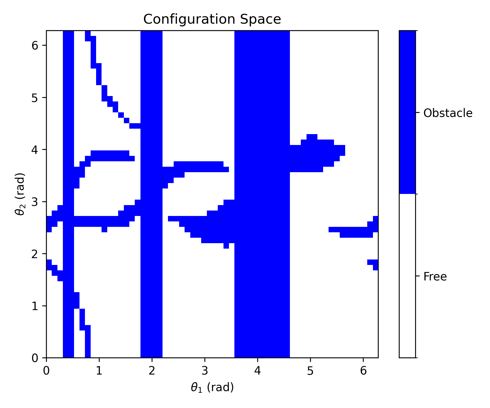
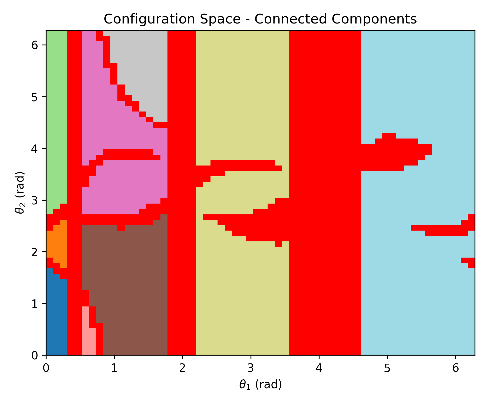
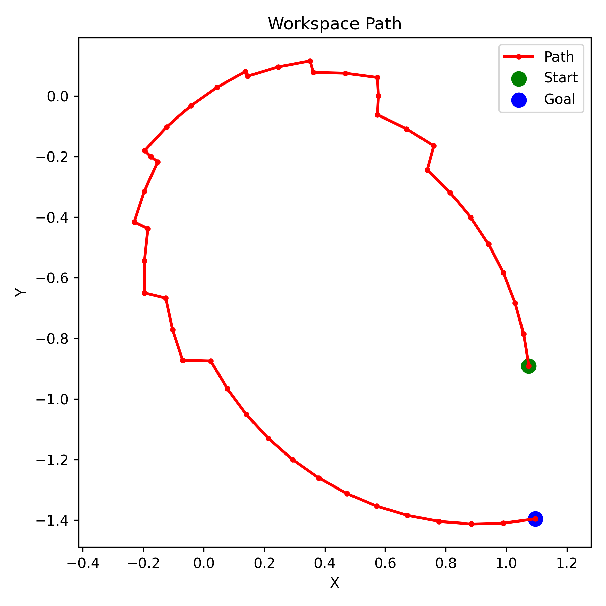
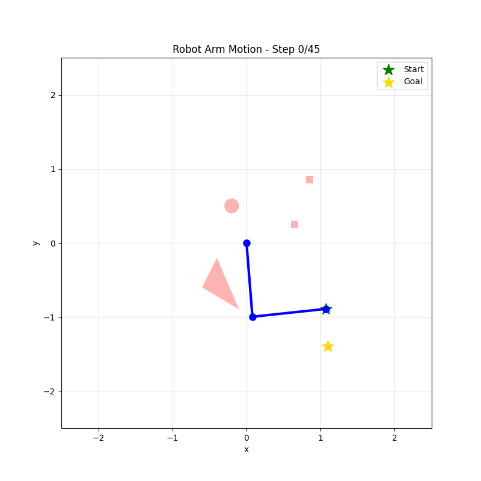

# Robot Arm Path Planning with Q-Learning

A Python implementation of motion planning for a 2-DOF planar robotic arm using Q-learning in configuration space. The project demonstrates how reinforcement learning can be applied to find collision-free paths in robotics.

## Table of Contents
- [Overview](#overview)
- [Theoretical Background](#theoretical-background)
- [Project Structure](#project-structure)
- [Installation](#installation)
- [Usage](#usage)
- [Results](#results)
- [Configuration](#configuration)
- [License](#license)

## Overview

This project implements robot motion planning for a two-link planar robotic arm operating in a workspace with obstacles. The robot learns to navigate from a start configuration to a goal configuration using tabular Q-learning, a model-free reinforcement learning algorithm.

### Key Features
- **2-DOF Planar Arm**: Forward kinematics for a two-link manipulator
- **Configuration Space (C-Space)**: Discretized representation of valid arm configurations
- **Collision Detection**: Uses Shapely library for geometric collision checking
- **Q-Learning**: Tabular reinforcement learning for path planning
- **Visualization**: Multiple visualization tools including workspace, C-space, and animated trajectories

## Theoretical Background

### Configuration Space

The **configuration space** (C-space) is a mathematical representation where each point corresponds to a unique configuration of the robot. For a 2-DOF planar arm:
- **Configuration**: (θ₁, θ₂) where θ₁ and θ₂ are joint angles
- **C-Obs**: $$C_{\text{obs}} $$ = Set of configurations where the arm collide with obstacles 
- **C-Free**: $$C_{\text{obs}} $$ = Set of configurations where the arm doesn't collide with obstacles
- **C-Space**: $$
    C = C_{\text{free}} \cup C_{\text{obs}}
    $$
- **Robot Motion Planning**: Finding a collision-free path in C-space that moves the robot from start to goal as fast as possible and then map it to a  
    valid motion in the workspace.

### Forward Kinematics

The end-effector position (x, y) is computed from joint angles:

```
x = l₁·cos(θ₁) + l₂·cos(θ₁ + θ₂)
y = l₁·sin(θ₁) + l₂·sin(θ₁ + θ₂)
```

where l₁ and l₂ are the link lengths.

### Q-Learning

Q-learning is a model-free reinforcement learning algorithm that learns an optimal policy by estimating action-values (Q-values):

**Update Rule**:
$$
Q(s, a) \leftarrow Q(s, a) + \alpha \big[ r + \gamma \max_{a'} Q(s', a') - Q(s, a) \big]
$$


Where:
- **s**: current state (configuration)
- **s'**: next state after choosing action **a** 
- **a**: action (joint angle change)
- **a'**: possible action in the next state s'
- **r**: reward (negative for steps, positive for goal, penalty for collision)
- **α**: learning rate (0.1 in this implementation)
- **γ**: discount factor (0.95, prioritizes long-term rewards)
- **ε**: exploration rate (starts at 0.9, decays exponentially to 0.01)

**Action Space**:
- Action 0: Increase θ₁
- Action 1: Decrease θ₁
- Action 2: Increase θ₂
- Action 3: Decrease θ₂

**Reward Structure**:
- Goal reached: +100
- Collision: -100 (stays in same state)
- Each step: -1 - 0.01·(Manhattan distance to goal)

**Epsilon Decay**:
- Exponential decay is applied each episode:  
  $$ \epsilon \leftarrow \max(\epsilon_{\min}, \epsilon \cdot (\epsilon_{\min}/\epsilon_{\text{initial}})^{1/num\_episodes}) $$
- Starts at 0.9, decays to 0.01 over training.

The algorithm explores initially (high ε) and gradually exploits learned knowledge (low ε) through epsilon decay.

## Project Structure

```
ProjectWorkRoboArm/
├── arm.py              # Robot arm kinematics model
├── obstacles.py        # Obstacle definitions and collision detection
├── cspace.py          # Configuration space representation
├── qlearning.py       # Q-learning algorithm implementation
├── visualize.py       # Visualization utilities
├── main.py            # Main execution script
├── LICENSE            # MIT License
└── README.md          # This file
```

### Module Descriptions

**`arm.py`**: Implements the `PlanarArm2DOF` class with forward kinematics and segment computation for collision detection.

**`obstacles.py`**: Provides functions to create geometric obstacles (rectangles, circles, polygons) using Shapely and collision detection between arm segments and obstacles.

**`cspace.py`**: Builds a discretized configuration space by checking collisions for all possible joint angle combinations.

**`qlearning.py`**: Implements the `QLearning2DOF` class with:
- Q-table initialization
- Epsilon-greedy exploration
- Q-value updates
- Path extraction from learned policy

**`visualize.py`**: Provides multiple visualization functions:
- Workspace with arm and obstacles
- C-space grid
- Connected components in free space
- Learned path in C-space and workspace
- Animated robot motion

**`main.py`**: Orchestrates the entire pipeline from obstacle definition to training and visualization.

## Installation

### Prerequisites
- Python 3.7 or higher
- pip package manager

### Required Libraries

```bash
pip install numpy matplotlib shapely scipy pillow
```

Or install from a requirements file:

```bash
pip install -r requirements.txt
```

**requirements.txt**:
```
numpy>=1.19.0
matplotlib>=3.3.0
shapely>=1.7.0
scipy>=1.5.0
pillow>=8.0.0
```

## Usage

### Basic Execution

Run the main script:

```bash
python main.py
```

This will:
1. Create a 2-DOF arm with unit link lengths
2. Define sample obstacles in the workspace
3. Build the configuration space (60×60 discretization)
4. Train the Q-learning agent for 5000 episodes
5. Extract and visualize the learned path
6. Generate plots and an animated GIF

### Customizing the Setup

Edit `main.py` to customize:

**Arm Configuration**:
```python
arm = PlanarArm2DOF([1.0, 1.0])  # [length1, length2]
```

**Obstacles**:
```python
obstacles = [
    make_rect(0.6, 0.7, 0.2, 0.3),        # Rectangle
    make_circle(-0.2, 0.5, 0.1),          # Circle
    make_polygon([(-0.5, -0.5), ...])     # Polygon
]
```

**C-Space Resolution**:
```python
cspace = ConfigurationSpace(
    arm=arm,
    theta1_range=(0, 2*np.pi),
    theta2_range=(0, 2*np.pi),
    N1=60,  # Discretization steps for θ₁
    N2=60   # Discretization steps for θ₂
)
```

**Start and Goal**:
```python
start = (45, 15)   # Indices in C-space grid
goal = (55, 50)
```

**Q-Learning Parameters**:
```python
ql = QLearning2DOF(
    cspace, 
    start=start, 
    goal=goal,
    alpha=0.1,      # Learning rate
    gamma=0.95,     # Discount factor
    epsilon=0.9     # Initial exploration rate
)

ql.train(
    num_episodes=5000,   # Training episodes
    max_steps=500        # Max steps per episode
)
```

## Results

### Training Output

The training process provides real-time feedback:

```
Episode 0: steps=500, reward=-3895.77, epsilon=0.900, success=0.0%, collisions=100.0%
Episode 1: steps=500, reward=-2239.68, epsilon=0.899, success=0.0%, collisions=100.0%
Episode 2: steps=500, reward=-2703.60, epsilon=0.898, success=0.0%, collisions=100.0%
Episode 3: steps=500, reward=-1720.84, epsilon=0.898, success=0.0%, collisions=100.0%
Episode 4: steps=500, reward=-2794.63, epsilon=0.897, success=0.0%, collisions=100.0%
Episode 5: steps=500, reward=-934.58, epsilon=0.896, success=0.0%, collisions=100.0%
Episode 6: steps=500, reward=-1968.21, epsilon=0.895, success=0.0%, collisions=100.0%
Episode 7: steps=500, reward=-2594.25, epsilon=0.894, success=0.0%, collisions=100.0%
Episode 8: steps=500, reward=-3837.18, epsilon=0.894, success=0.0%, collisions=100.0%
Episode 9: steps=500, reward=-1980.13, epsilon=0.893, success=0.0%, collisions=100.0%
Episode 100: steps=500, reward=-2116.05, epsilon=0.823, success=3.0%, collisions=98.0%
Episode 200: steps=500, reward=-3213.57, epsilon=0.752, success=6.0%, collisions=96.5%
Episode 300: steps=246, reward=-1199.59, epsilon=0.687, success=11.6%, collisions=95.7%
...
Episode 4900: steps=47, reward=43.91, epsilon=0.011, success=89.3%, collisions=25.3%

Training completed. Final success rate: 89.5%
Collision rate: 24.8%
Visited states: 887 / 3600
Goal reached in 46 steps!
```

### Generated Outputs

1. **`workspace.png`**: Shows the arm in initial configuration with obstacles
    
2. **`cspace.png`**: Visualizes free space (white) and C-space obstacles (blue)
     
3. **`cspace_components.png`**: Shows connected components of free space
    
4. **`workspace_path.png`**: Displays the learned trajectory in workspace coordinates
    
5. **`robot_motion.gif`**: Animated visualization of the robot executing the learned path
    

### Performance Metrics

- **Success Rate**: Percentage of episodes where the goal was reached
- **Path Length**: Number of steps in the final learned path
- **State Coverage**: Number of states visited during training
- **Convergence**: Typically converges within 2000-5000 episodes

### Typical Results

With the default configuration:
- **Path length**: ~35-45 steps (depending on obstacle configuration)
- **Training time**: 30-60 seconds on modern hardware
- **Success rate**: 85-95% after full training
- **Smooth trajectory**: The path avoids obstacles with adequate clearance

## Configuration

### Hyperparameter Tuning

**Learning Rate (α)**:
- Higher values (0.3-0.5): Faster learning but less stable
- Lower values (0.05-0.1): Slower but more stable convergence
- Default: 0.1

**Discount Factor (γ)**:
- Values close to 1 (0.95-0.99): Prioritizes long-term rewards
- Lower values (0.8-0.9): More myopic behavior
- Default: 0.95

**Exploration Rate (ε)**:
- Initial high value (0.9): Encourages exploration
- Decays to minimum (0.05): Shifts to exploitation
- Decay rate: 0.9995 per episode

**Grid Resolution**:
- Higher resolution (100×100): More precise but slower training
- Lower resolution (40×40): Faster but less precise paths
- Default: 60×60 (good balance)

### Common Issues

**Start/Goal in Obstacle**:
```
ValueError: Start position is inside an obstacle!
```
Solution: Choose different start/goal indices that are in free space.

**Path Not Reaching Goal**:
- Increase training episodes
- Adjust reward structure
- Check if start and goal are in the same connected component

**Slow Training**:
- Reduce C-space resolution
- Decrease number of episodes
- Optimize collision checking

## License

This project is licensed under the MIT License - see the [LICENSE](LICENSE) file for details.

## Future Improvements

- [ ] Implement continuous Q-learning with function approximation
- [ ] Add support for 3-DOF or higher manipulators
- [ ] Implement other RL algorithms (SARSA, Deep Q-Networks)
- [ ] Add dynamic obstacles
- [ ] Optimize collision detection for real-time performance
- [ ] Include inverse kinematics solver
- [ ] Add ROS integration for physical robot control

## References

1. Watkins, C. J., & Dayan, P. (1992). Q-learning. *Machine Learning*, 8(3-4), 279-292.
2. LaValle, S. M. (2006). *Planning Algorithms*. Cambridge University Press.
3. Sutton, R. S., & Barto, A. G. (2018). *Reinforcement Learning: An Introduction*. MIT Press.

## Author

eledaveri

## Acknowledgments

This project was developed as an educational implementation of path planning using reinforcement learning for robotic manipulators.